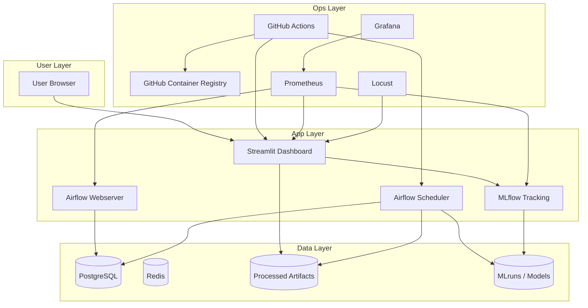

# 📊 RetailPulse: AI-Powered Customer Analytics & Demand Forecasting

RetailPulse is an end-to-end, production-ready customer analytics and demand forecasting platform built for online retail intelligence. The system integrates advanced machine learning models (Prophet, LSTM, and Hybrid Ensembles), customer clustering (K-Means, DBSCAN), and XGBoost churn prediction with MLOps scaffolding (MLflow experiment tracking, Optuna tuning, Apache Airflow orchestration, and Evidently drift monitoring).

---

## 🛠️ Subsystem Capabilities

### 1. 📈 Demand Forecasting
- **Prophet Pipeline**: Captures daily and weekly seasonal components, modeling holiday spikes and general trends.
- **Deep Learning (LSTM) Pipeline**: Utilizes sequence-to-sequence neural networks built in PyTorch to capture non-linear temporal dependencies.
- **Hybrid Ensemble**: Blends statistical and deep learning approaches to minimize out-of-sample prediction error.
- **Auto-Tuning**: Integrates **Optuna** to optimize learning rates, seasonality modes, and network layers automatically.

### 2. 👥 Customer Segmentation (RFM)
- **RFM Aggregation**: Converts raw transactions into Recency, Frequency, and Monetary metrics.
- **Dual Clustering**: Employs **K-Means** (optimized via silhouette analysis) and **DBSCAN** (optimized via hyperparameter grids) to discover customer groups.
- **Persona Mapping**: Translates raw clusters into actionable business personas (*Champions*, *Loyal Customers*, *Big Spenders*, *At Risk*, and *Lost*).
- **Dimensionality Reduction**: Visualizes high-dimensional RFM patterns in 2D using **PCA** and **t-SNE**.

### 3. 🎯 Customer Churn Prediction
- **XGBoost Classifier**: Predicts probability of customer attrition based on recent transaction frequency and activity drops.
- **Explainability**: Employs **SHAP** values to explain individual predictions and highlight global features driving churn (e.g., Recency and drop in Monetary value).

### 4. 📦 Inventory Optimization
- **Dynamic Safety Stock**: Translates daily forecasting limits into safe holding levels.
- **Reorder Point (ROP) & Economic Order Quantity (EOQ)**: Calculates optimal timing and quantity for stock purchases, minimizing holding vs. stockout costs.

### 5. 🔍 Drift & Model Monitoring
- **Evidently Monitoring**: Compares sliding windows of current inputs against baseline training references.
- **Alert Scaffolding**: Identifies feature distribution drifts and target concept drift to schedule automated retraining.

---

## 🏗️ Platform Architecture

The system is organized into a clean, multi-layered architecture:



---

## 📂 Project Anatomy

```text
RetailPulse/
├── .github/workflows/      # CI/CD pipelines (validation, Docker build, Streamlit runtime check)
├── .streamlit/             # Streamlit custom themes & runtime configs
├── airflow/                # Airflow orchestration DAGs
│   └── dags/               # Pipelines for ETL, retraining, inventory reporting, and monitoring
├── docker/                 # Docker Compose overrides and service configurations
├── docs/                   # Detailed architectural, setup, and deployment guides
├── k8s/                    # Kubernetes manifests (deployments, services, ingress)
├── mlruns/                 # Local MLflow experiments storage
├── models/                 # Serialized model weights and scalar artifacts
├── notebooks/              # Exploratory data analysis and prototype notebooks
├── scripts/                # Helper utilities for starting/stopping Docker & K8s environments
├── src/                    # Central codebase modules (dashboard logic, forecasting, clustering)
├── requirements.txt        # Production dependencies
└── retailpulse_dashboard.py# Streamlit single-point-of-entry
```

---

## 🚀 Getting Started (Local Setup)

### 1. Prerequisites
Ensure you have the following installed:
- Python 3.9+
- Docker & Docker Compose (optional, for full-stack deployment)
- Minikube / kind (optional, for Kubernetes validation)

### 2. Installation
We recommend using `venv` or `uv` for speed and virtual environment isolation:

```powershell
# Create and activate virtual environment
python -m venv .venv
.venv\Scripts\Activate.ps1

# Install requirements
pip install -r requirements.txt
```

### 3. Initialize Data Pipelines
Set up your environment config by copying `.env.template` to `.env`, then run the feature ETL and modeling pipelines:

```powershell
# Run feature engineering pipeline (pre-processes Raw Retail II dataset)
python retailpulse_feature_pipeline.py

# Run modeling pipelines
python retailpulse_prophet_pipeline.py
python retailpulse_lstm_pipeline.py
python retailpulse_customer_segmentation.py
python retailpulse_optuna_optimization.py
```

### 4. Start the Streamlit Dashboard
Launch the visualization dashboard locally:
```powershell
streamlit run retailpulse_dashboard.py
```

---

## 📈 Experiment Tracking & Orchestration

### MLflow Tracking Server
To view all parameters, metrics, metrics history, and model models:
```powershell
# Start local MLflow server
mlflow server --host 127.0.0.1 --port 5000
```
Navigate to `http://localhost:5000` to inspect the UI dashboard. Runs are automatically tracked via `retailpulse_mlflow_tracking.py`.

### Airflow Orchestration
Airflow schedules and runs our pipelines. To run the scheduler and webserver locally:
```powershell
# In terminal 1 (start Airflow scheduler)
airflow scheduler

# In terminal 2 (start Airflow webserver)
airflow webserver --port 8080
```
Navigate to `http://localhost:8080` (default login: admin/admin) to manage pipelines such as retraining, drift checks, and inventory recalculations.

---

## 🐳 Containerized & Cloud Deployment

### 1. Docker Compose (Full Stack)
Build and run the entire stack (Postgres, Redis, Airflow, MLflow, and Streamlit):
```powershell
# Build and run using the helper script
scripts/start_week4.ps1 -Build

# Stop the stack
scripts/stop_week4.ps1
```
For more information, see the [Docker Setup Guide](docs/Docker-setup.md).

### 2. Kubernetes
Deploy the stack to a local cluster:
```powershell
# Deploy manifests to Minikube
scripts/k8s_minikube_start.ps1
```
See [Kubernetes Deployments](k8s/README.md) for ingress and service routing configurations.

### 3. Streamlit Cloud
The dashboard has a lightweight configuration to deploy directly onto Streamlit Cloud for zero-cost hosting. Refer to the [Streamlit Cloud Guide](docs/Streamlit-Cloud.md) for details.

---

## 🔄 CI/CD Pipelines
Our repository validates code stability on every pull request and push to the master branch using GitHub Actions:
- **`validation.yml`**: Validates file structures and formats.
- **`ci.yml`**: Runs syntax checks, code formatters, and style linters.
- **`streamlit-runtime.yml`**: Validates Streamlit entrypoint execution and runs a server health-check against `/_stcore/health`.
- **`docker-build.yml`**: Verifies that the Docker container stack builds properly.
- **`deployment-check.yml`**: Verifies Kubernetes manifests syntax and configuration mappings.

---

## 🤖 Repository Memory Layer (Graphify)
This repository uses **Graphify** as a persistent memory and relationship index. This ensures future developer agents or Copilot chat assistants can understand the dependency mapping across modules instantly:
- Run `graphify update .` to rebuild the index after changes.
- Refer to [AI Onboarding Guide](AI_ONBOARDING.md) to explore the memory layers in detail.
