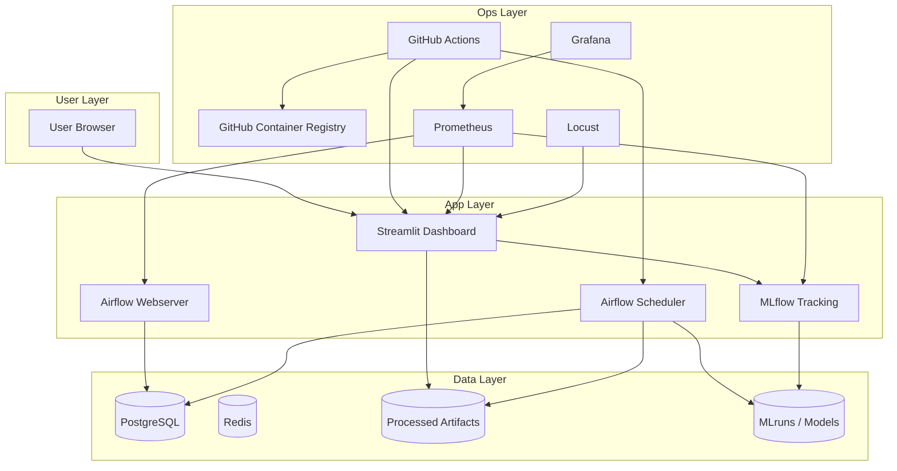

# RetailPulse Architecture Diagram

## System Overview

## Deployment Targets

- Local: Docker Compose (full stack)
- Local cluster: Minikube or kind (Kubernetes manifests)
- Public app: Streamlit Cloud (dashboard only)
